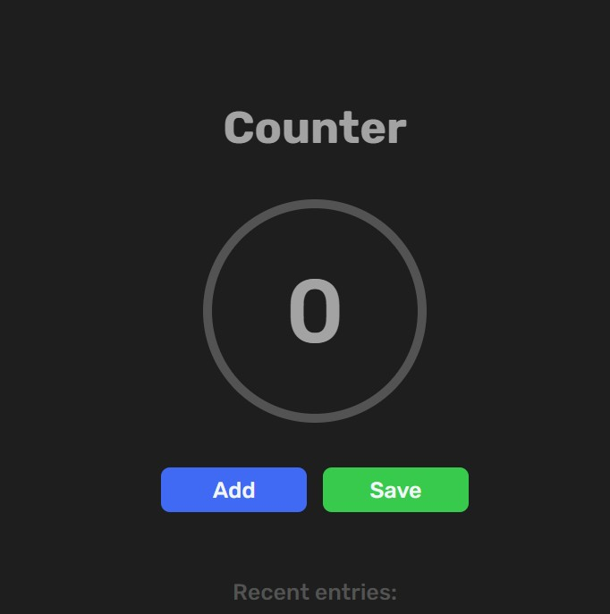

# counter_app

Simple counter app using HTML, CSS, and Javascript.  
Also uploaded in my other projects folder in roadmap.sh
[roadmap_repo](https://github.com/mariano-shem/roadmap.sh-projects)

# Try the app

